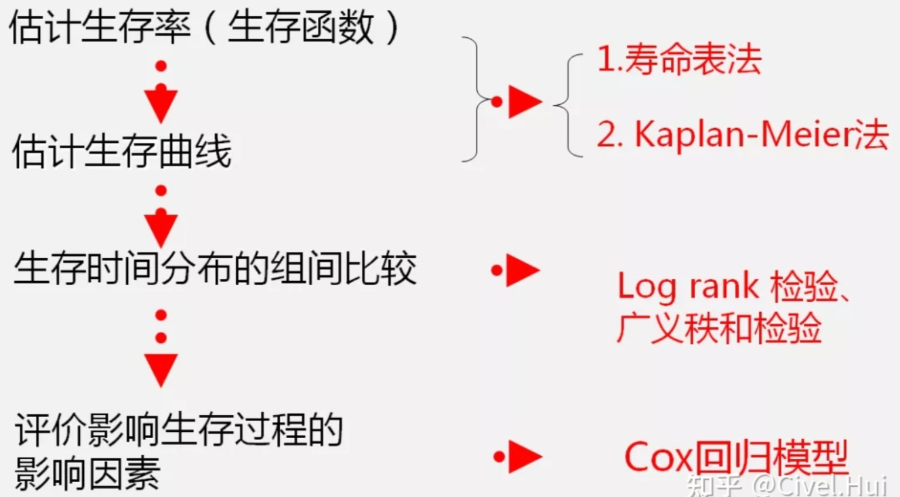

### 基本概念

* 生存分析是一种统计分析方法，用于研究个体在时间轴上的生存情况（例如生存时间、生存率等），并探究各种因素对生存情况的影响。
* 在医学或者公共卫生研究中，慢性疾病的发生、发展、预后一般不适用于治愈率、病死率等指标来考核，因为其无法在短时间内明确判断预后情况，为此，只能对患者进行长期随访，统计一定时期后的生存或死亡情况以判断诊疗效果；
* 这样的研究往往会产生带有结局的生存时间资料，英文是time-to-event资料。在分析方法上，需要采用生存分析方法。

### ==什么是生存分析问题？==

生存分析问题指的是研究个体在时间轴上的生存情况（例如生存时间、生存率等），并探究各种因素对生存情况的影响的问题。生存分析问题通常应用于医学、生物、环境等领域，用于研究某些事件（例如死亡、复发、失业等）发生的时间和概率，以及各种因素（例如年龄、性别、疾病状态、治疗方案等）对这些事件的影响。

生存分析问题通常需要对生存数据进行收集和分析。生存数据通常包括生存时间、事件状态（例如是否死亡）、危险因素（例如年龄、性别、疾病状态、治疗方案等）等。生存数据的分析方法包括描述性统计分析、生存曲线分析、Cox比例风险模型等。

生存分析问题的应用领域非常广泛，例如：

1. 医学领域：用于研究治疗方案的有效性、疾病预后等。
2. 生物领域：用于研究动物和植物的寿命、生长和繁殖等。
3. 工业领域：用于研究产品的寿命、可靠性等。
4. 金融领域：用于研究客户的存款和贷款的生命周期、信用评级等。

生存分析问题的研究对于了解各种事件的发生规律、预测事件发生的概率、评估危险因素的影响等方面都具有重要的意义。

### ==生存问题的数据特点？==

1. 时间至关重要：生存问题的数据通常包括个体的生存时间，即从某个起始点到某个特定事件的时间间隔。因此，时间是生存数据的核心特征，对于生存分析的结果具有决定性的影响。
2. 数据右截断：在生存数据的研究中，有些个体在研究结束时仍然存活，而有些个体却在研究期间死亡或出现其他特定事件。因此，生存数据通常是右截断的，即有些个体在研究结束时仍然存活，它们的生存时间尚未结束，但是我们只能观察到它们在某个时间点前的生存情况。
3. 数据不完整：生存数据通常存在一些数据不完整的情况。例如，有些个体在研究期间失去了随访，或者出现了其它原因导致数据缺失的情况。这些缺失数据可能会影响生存分析的结果，需要进行适当的处理。
4. 事件发生率低：在生存数据的研究中，事件通常是相对罕见的，例如死亡、复发等，因此事件发生率往往比较低。这意味着需要收集大量的数据来保证生存分析的可靠性。
5. 非独立数据：生存数据通常具有群组结构，例如医学研究中的多中心随机对照试验、家族研究等。这些数据具有非独立性，需要考虑群组效应对生存分析的影响。

综上，生存问题的数据特点主要包括时间至关重要、数据右截断、数据不完整、事件发生率低、非独立数据等方面。这些特点需要在生存数据的收集和分析过程中得到充分考虑，以保证生存分析的可靠性和有效性。

### 定义

* 生存数据不仅仅指的是生命是生、是死的数据；广义而言，生存结局指的是研究对象是否出现我们研究者感兴趣的阳性终点事件；更广泛来说，生存结局是某一现象是否出现失效（failure）事件。

* ==生存时间==：指从某个起始点（例如诊断时间、手术时间等）到一个特定事件（例如死亡、复发等）所经历的时间。

* ==生存率==：指在某个时间点上仍然存活的个体占总体的比例。生存率可以用生存曲线来表示，即横轴为时间，纵轴为生存率。

* ==生存分布函数==（Survival Function）：指在任意时间点上生存率的概率密度函数，表示个体在不同时间点上生存的可能性。

* ==风险比==（Hazard Ratio）：指两个不同群体之间生存时间的比较，即其中一个群体的生存风险相对于另一个群体的生存风险的比值。

* ==Cox比例风险模型==（Cox Proportional Hazards Model）：是一种生存分析模型，用于探究各种因素对生存时间的影响。该模型假设各个危险因素对生存风险的影响是乘性的，即危险比在不同时间点上是相同的，且不受时间的影响。该模型可以用来估计各个因素对生存时间的影响，并进行风险因素的调整。

* Kaplan-Meier曲线：是一种生存分析方法，用于估计生存分布函数。该曲线是一条递减的阶梯状曲线，横轴表示时间，纵轴表示生存率，可以用来比较不同组别之间的生存情况。

* 生存函数：是描述个体在某个时间点之前生存的概率的函数。在生存分析中，生存函数通常用S(t)来表示，表示在时间t之前生存的概率。生存函数的定义可以扩展到其他事件，例如失业、复发等，但在本文中我们以死亡为例进行讨论。

  ==生存函数==的定义可以表示为：在时间t之前生存的个体数占总个体数的比例。即：

  $S(t) = P(T > t)$

  其中，T表示生存时间的随机变量，P(T > t)表示生存时间大于t的概率，也就是在时间t之前生存的概率。

  生存函数S(t)的特点：

  1. S(t)的取值范围为[0,1]，表示生存的概率。
  2. S(t)是递减的函数，即随着时间的增加，生存的概率逐渐降低。
  3. S(t)的下降速度越快，表示生存的概率下降的越快。
  4. S(t)在时间t处的导数是死亡率，即$d/dt S(t) = -f(t)$，其中f(t)表示在时间t发生死亡的个体数占总个体数的比例，也称为死亡概率密度函数。

  生存函数是生存分析中的重要概念，可以用于比较不同组别之间的生存情况，例如不同治疗方案、不同性别等。生存函数也可以用于预测个体在特定时间内的生存概率，例如在5年内生存的概率是多少。生存函数的估计方法有很多种，包括KM曲线、Nelson-Aalen累积风险函数等。

* ==风险累计函数==是一种描述时间依赖危险因素对生存率影响的函数，也称为Nelson-Aalen累积风险函数。风险累计函数的定义可以表示为：在时间t之前，受到危险因素影响的个体数与总个体数之比。即：

  $H(t) =∑[Y_i ≤ t] (d_i / Y_i)$

  其中，$Y_i$表示个体i的生存时间，$d_i$表示个体i在时间$t$发生事件（例如死亡）的指示变量，等于1表示发生事件，等于0表示未发生事件。$[Y_i ≤ t]$表示生存时间小于等于$t$的个体i的集合。风险累计函数$H(t)$的意义为：在时间t之前，受到危险因素影响的个体数与总个体数之比，也就是在时间t之前发生事件的个体数与总个体数之比。

  风险累计函数的特点：

  1. 风险累计函数H(t)是递增的函数，表示随着时间的增加，受到危险因素影响的个体数与总个体数之比逐渐增加。
  2. 风险累计函数H(t)的增长速度反映了危险因素对生存率的影响程度，增长速度越快，表示危险因素对生存率的影响越大。
  3. 风险累计函数H(t)可以用于比较不同组别之间的生存情况，例如不同治疗方案、不同性别等。

  风险累计函数是生存分析中的重要概念，可以用于估计危险因素对生存率的影响程度，也可以用于预测个体在特定时间内的生存概率。风险累计函数的估计方法包括Nelson-Aalen估计和Breslow估计等。

### ==**生存分析的目的与方法**==？

针对生存数据，核心目标便是评价一个群体的“死亡速度”，具体比较的是生存时间长短；此外，我们还可以分析由“死亡速度”产生的另外一个里程概念，“死亡”率或者“生存”率。（再次提醒，这里的生存与死亡不是狭义上的概念，而是是否出现阳性事件）。

**具体来说，根据研究目的，生存分析的研究内容可以分为以下4点**：

1. 描述生存过程，计算生存时间、计算生存率（或者死亡率）、计算死亡速度
2. 比较生存过程，比较生存时间、比较生存率（或者死亡率）、比较死亡速度
3. 探讨影响生存时间（生存速度）的影响因素
4. 预测生存概率

**不同的生存分析内容，有不同的统计分析策略：**

**1. 描述生存过程方面，**一般采用经典的寿命表法或者 或者Kaplan-Meier法来计算生存率、计算中位生存时间、并且用生存曲线的方式来描述生存过程

**2.比较生存过程方面，**一般采用logRank或者广义秩和检验的方法开展生产时间资料分布的组间差异性

**3.探讨影响生存时间（生存速度）的影响因素、预测生存概率方面，**最常用也是最经典的便是Cox回归分析。

几种方法中，logRank和广义秩和检验的方法是属于基础统计学方法领域新的方法，和t检验、F检验、卡方检验地位相同，主要探讨差异性或者简单关联性。Cox回归和线性回归、Logistic回归地位相同，主要可以用于开展多因素的回归分析。

基础统计学方法和高级统计学方法往往紧密合作，在生存分析领域，logRank方法和Cox方法也往往成双成对地出现。

### ==**生存分析的应用场合**==

**在当今医学领域，无论在临床领域、还是公共卫生领域、甚至是针对动物的实验研究，都可能用到生存分析。**原因在于，目前随访性研究越来越多，公共卫生领域喜欢开展大型随访性队列研究，而临床领域，也喜欢开展患者预后分析，也需要随访。

**总的来说，生存分析主要用在两种研究设计类型的数据分析中：实验性研究和队列研究。**

**实验性研究**是随访性研究，研究者可以通过比较实验组和对照组在生存率、中位生存时间方面是否存在着统计学差异，来探讨干预措施对患者临床结局的改善作用。目前大型临床试验，将近1/3采用的统计学方法是生存分析方法。

队列研究，研究者可以通过比较暴露组和对照组在生存率、中位生存时间方面是否存在着统计学差异。队列研究可以用于临床研究评价治疗措施疗效，也可以用于公共卫生开展病因学的研究。由于队列研究不如实验性研究，在患者控制上往往心有余而力不足，所以缺失现象非常严重，缺失的数据，一般的统计学方法很难应付，但是生存分析可以解决，因此基本上大型队列研究，生存分析是主要的方法。

### ==传统的生存分析方法==

传统的生存分析方法主要包括描述性生存分析、生存曲线分析和Cox比例风险模型。

1. 描述性生存分析：描述性生存分析是对生存数据的基本统计描述，包括生存时间的中位数、平均数、生存率等。描述性生存分析通常用于了解生存数据的基本特征，但无法探究各种因素对生存情况的影响。
2. 生存曲线分析：生存曲线分析是一种用于估计生存分布函数的方法，通常采用Kaplan-Meier曲线来表示生存率随时间的变化。生存曲线分析可以比较不同组别之间的生存情况，如不同治疗方案的生存率等。但生存曲线分析无法考虑多个危险因素的影响。
3. Cox比例风险模型：Cox比例风险模型是一种常用的生存分析方法，可以同时考虑多个危险因素对生存情况的影响。Cox模型基于半参数模型，通过估计每个危险因素的风险比来描述不同因素对生存情况的影响。Cox模型的优点在于不需要假设生存数据的分布，且可以考虑多个危险因素的影响。但Cox模型也存在一些缺点，例如无法处理时间依赖性的危险因素等。

综上，传统的生存分析方法包括描述性生存分析、生存曲线分析和Cox比例风险模型。这些方法在生存数据的分析中具有一定的应用价值，但也存在各自的局限性，需要根据具体问题选择合适的方法进行分析。

#### ==1.KM曲线==

KM曲线是一种用于估计生存率的非参数方法，也称为Kaplan-Meier曲线。KM曲线是基于观察到的生存数据，利用生存时间和事件状态（例如死亡、失业等）来估计生存率的函数。KM曲线的横轴是时间，纵轴是生存率，曲线的下降表示生存率逐渐降低。

KM曲线的估计方法基于生存函数的定义，即生存函数S(t)表示在时间t之前生存的概率。KM曲线的计算方法如下：

1. 将所有个体按照生存时间从小到大排序，得到一个生存时间序列。
2. 对于每个生存时间t，计算该时间点之前的生存率，即生存时间大于t的个体数除以总个体数。
3. 如果某个个体在时间t时发生了事件（例如死亡），则将该个体从总个体数中删除。
4. 重复步骤2和3，直到所有时间点都被处理完。
5. 将所有生存率按照时间顺序连接起来，形成KM曲线。

KM曲线可以用于比较不同组别之间的生存情况，例如不同治疗方案、不同性别等。两组之间的KM曲线的差异可以通过Log-rank检验来进行统计显著性检验。KM曲线也可以用于预测个体的生存概率，例如在特定时间内生存的概率是多少。

需要注意的是，KM曲线的估计结果受到右截断数据的影响，因为右截断数据中有些个体的生存时间尚未结束，无法观察到其真实的生存时间。因此，在进行KM曲线估计时需要考虑右截断数据的影响，并对右截断数据进行适当的处理。

#### ==2.分组KM曲线==

分组KM曲线是在不同组之间比较生存率的一种方法，也称为比较KM曲线。分组KM曲线是使用KM曲线来绘制不同组之间的生存曲线，以便比较不同组之间的生存情况。

分组KM曲线的绘制过程如下：

1. 将个体按照某个特征（例如治疗方案、性别、年龄等）进行分组，得到不同组别的个体集合。
2. 对于每个组别，使用KM曲线估计该组别的生存函数，并绘制该组别的KM曲线。
3. 将不同组别的KM曲线进行比较，观察不同组别之间的生存率差异，可以使用Log-rank检验等方法进行统计显著性检验。

分组KM曲线的优点是可以比较不同组别之间的生存情况，从而评估不同因素对生存率的影响程度。分组KM曲线也可以用于预测个体在特定时间内的生存概率，并为临床医学决策提供参考。

#### ==3.Cox模型==

比例风险模型（Proportional Hazards Model）是生存分析中常用的一种统计模型，也称为Cox回归模型。比例风险模型可以用于探究影响生存时间的危险因素对生存时间的影响程度，并可以预测个体在未来的生存概率。

比例风险模型的基本假设是危险比在时间上是恒定的，即各个时间点上的危险比都是相同的。危险比（Hazard Ratio）是表示两个组之间生存危险的比值，即两个组之间的死亡率比值。比例风险模型的核心是危险比函数，它描述了不同危险因素对生存时间的影响程度。

比例风险模型的数学表达式如下：

$h(t|X) = h0(t) * exp(β1*X1 + β2*X2 + ... + βp*Xp)$

其中，$h(t|X)$表示在协变量为X的情况下，时间t的危险比函数；$h0(t)$表示基准危险比函数，它是时间t的基础危险比，不受协变量的影响；$exp(β1*X1 + β2*X2 + ... + βp*Xp)$表示协变量的效应，$β1, β2, ..., βp$是协变量的系数，$X1, X2, ..., Xp$是协变量的取值。

比例风险模型的优点是可以探究多个危险因素对生存时间的影响程度，并可以通过危险比函数预测个体在未来的生存概率。比例风险模型的缺点是对比例风险假设的依赖较强，如果假设不成立，则模型的结果可能不准确。此外，比例风险模型需要大量数据和较高的统计功底，使用时需要谨慎。

#### ==4.列线图==

列线图是一种常用的数据可视化方法，可以同时展示多个类别或变量之间的数值差异和趋势变化。它通常由一组垂直的柱状图和一条或多条折线图组成，柱状图用于表示各类别或变量的数值大小，折线图用于表示各类别或变量的趋势变化。

列线图可以用于比较不同类别或变量之间的数值差异和趋势变化，以及观察同一类别或变量在不同时间点的变化情况。它通常用于展示时间序列数据、统计数据、调查数据等。

列线图的绘制过程如下：

1. 收集需要展示的数据，并将其按照类别或变量进行分类。
2. 选择合适的图表工具绘制柱状图和折线图，通常可以使用Excel、R、Python等软件进行绘制。
3. 将柱状图和折线图组合在一起，使其呈现出一种整体的视觉效果。
4. 添加必要的标注和注释，包括图表标题、坐标轴标签、图例、数据标签等。

列线图的优点是可以同时展示多个类别或变量之间的数值差异和趋势变化，更加直观地展示数据的特征和规律。列线图的缺点是当类别或变量数量较多时，图表会显得比较复杂，容易造成信息重叠和混淆。此外，数据的选择和处理对于列线图的准确性和可信度也有很大影响。

#### 5.==动态列线图==

动态列线图是一种用于可视化时间序列数据的图表类型，它可以反映不同因素随时间变化的趋势和关系。动态列线图通常由多个列和线组成，每个列表示一个时间点或时间段内的数量或比例，每条线则表示一个因素在不同时间点或时间段内的变化趋势。

动态列线图的设计需要考虑以下几个方面：

1.数据格式：动态列线图需要使用时间序列数据，通常是按照时间顺序排列的一系列数据点。数据点可以表示不同时间点或时间段内的数量、比例、频率等指标。

2.坐标轴设置：动态列线图需要设置横轴和纵轴，横轴通常表示时间，纵轴则表示数量、比例、频率等指标。在设置纵轴时，需要考虑数据的范围和分布情况，选择合适的刻度和标签。

3.颜色和标记：动态列线图需要使用不同颜色和标记来区分不同列和线。在选择颜色和标记时，需要考虑视觉效果和可读性，尽可能避免颜色过于相似或难以区分的情况。

4.交互功能：动态列线图通常具有交互功能，可以根据用户的需求和操作来动态显示或隐藏不同列和线，放大或缩小特定时间段的数据等。

动态列线图可以用于可视化各种时间序列数据，比如股票价格、气温变化、用户行为数据等。它可以帮助用户更直观地理解数据的趋势和关系，发现潜在的规律和异常情况，支持数据驱动的决策和分析。

### ==生存分析模型的评价==

生存分析模型的评价可以从多个方面进行，包括模型的拟合优度、模型的预测能力、模型的稳健性和模型的解释力等。

1. 模型的拟合优度：模型的拟合优度反映了模型对数据的拟合程度，通常使用对数似然、Akaike信息准则（AIC）或贝叶斯信息准则（BIC）等指标进行评价。对数似然值越大，AIC和BIC值越小，说明模型拟合效果越好。
2. 模型的预测能力：模型的预测能力反映了模型对新样本的预测能力，通常使用交叉验证、ROC曲线、C统计量等指标进行评价。交叉验证可以评估模型的泛化能力，ROC曲线和C统计量可以评估模型的分类准确性。
   1. 区分能力（discrimination）：指的是模型区分有病/没病，死亡/活着等结局的预测能力。简单举个例子，比如说，现有100个人，50个有病，50个健康；你用预测模型预测出46个有病，54个没病。那么这46个覆盖到50个真正有病的人的多少就直接决定了你模型预测的靠谱程度，和准确性。通常用ROC、C指数来度量，当然NRI（Net
      reclassification improvement）和 IDI（integrated
      discrimination improvement）也是度量指标之一。
   2. 一致性 （Calibration）：指结局实际发生的概率和预测的概率的一致性。读起来有点费解，我们还是举上面这个例子，我们预测的100个人，不是指我们真用模型预测出来有病/没病，模型只给我们有病的概率，根据概率大于某个截断值（比如说0.5）来判断有病/没病。100个人，我们最终通过模型得到了100个概率，也就是100个0-1之间的数，我们将这100个数，按照从小到大排列，再依次将这100个人分成10组，每组10个人，实际的概率就是这10个人中发生疾病的比例，预测的概率就是每组预测得到的10个数的平均值，然后比较这两个数，一个作为横坐标，一个作为纵坐标，就得到了一致性曲线图（当然得到95%可信区间后更完整了）。当然一致性还可以通过
      Hosmer-Lemeshow goodness-of-fit test 来度量。
   3. 总体上（overall）：事实上就是综合了区分能力和一致性的度量指标，比如
      R2。

1. 模型的稳健性：模型的稳健性反映了模型对极端值、异常值和缺失值等问题的鲁棒性，通常使用敏感性分析、离群值检测和缺失值处理等方法进行评价。
2. 模型的解释力：模型的解释力反映了模型对危险因素的解释能力，通常使用危险比、风险比等指标进行评价。危险比或风险比越大，说明该危险因素对生存时间的影响越大。

综合考虑以上指标，可以对生存分析模型的优劣进行评价。在实际应用中，需要根据具体研究问题和数据特点选择合适的评价指标，并进行综合分析和比较，以选择最优的生存分析模型。

#### 1.==一致性因子==

生存分析模型中常用的一致性因子是C统计量（Concordance statistic），它用于衡量模型的预测准确性和一致性程度。

C统计量是基于排名的一致性指标，通常用于评估预测模型对二元事件的预测准确性，其取值范围为0.5到1.0。C统计量越接近1.0，说明模型的预测准确性和一致性程度越高。当C统计量为0.5时，说明模型的预测效果等同于随机猜测。

C统计量的计算方法是将所有的样本按照预测值从大到小进行排列，然后计算模型预测值的等级和实际事件发生的等级之间的一致性比例。具体而言，对于样本对(i,j)，如果模型预测的风险值Ri大于Rj，并且实际事件发生在i时刻，那么就将预测值的等级与实际事件的等级视为一致，否则视为不一致。最终，C统计量即为一致性比例的平均值。

除了C统计量，生存分析模型的评价还可以使用其他指标，如对数损失函数、Kaplan-Meier曲线、平均绝对误差等。综合考虑这些指标，可以对生存分析模型的预测准确性和一致性程度进行全面的评价和比较。

#### 2.==一致性因子的偏差校正==

生存分析模型中的一致性因子C统计量通常不需要进行偏差校正，因为C统计量是基于排名的一致性指标，不受具体时间尺度和概率分布的影响，具有较高的稳定性和可靠性。

然而，在使用其他评价指标时，比如对数损失函数和平均绝对误差等，可能需要进行偏差校正以提高评价的准确性和可靠性。偏差校正的方法通常采用交叉验证（Cross-validation）或引入惩罚项（Penalty term）进行校正。

在交叉验证中，将数据集分为若干个子集，利用其中一部分数据进行模型训练，然后利用剩余的数据进行模型评价。重复多次，将不同的子集用于训练和评价模型，最终将得到多组评价指标。利用这些评价指标的平均值作为模型的最终评价结果，可以有效降低评价指标的偏差和随机误差。

引入惩罚项是一种常见的偏差校正方法，它通过在损失函数中添加一项惩罚项，对模型的复杂度进行限制，避免模型对训练数据的过度拟合。惩罚项的大小通常由超参数来控制，可以通过交叉验证等方法进行选择。

总之，生存分析模型的评价指标的偏差校正方法可以根据具体的评价指标和数据情况进行选择，以提高评价指标的准确性和可靠性。

#### 3.==ROC-AUC随时间变化曲线==

ROC-AUC随时间变化曲线是一种用于评估生存分析模型预测准确性和稳定性的方法。它基于接收者操作特征曲线（ROC曲线）和面积统计值（AUC），考虑了时间因素对模型预测的影响，可以反映模型在不同时间点的预测准确性和稳定性变化情况。

ROC曲线是以真阳性率（True Positive Rate，TPR）为纵轴，假阳性率（False Positive Rate，FPR）为横轴的曲线，用于评价二元分类模型的准确性和灵敏度。而ROC-AUC值则是ROC曲线下方的面积，通常取值范围为0.5到1.0，越接近1.0表示模型的预测准确性和稳定性越高。

在生存分析中，ROC曲线和ROC-AUC值可以通过将模型预测的概率转化为风险得分，然后按照风险得分从小到大排序，得到相应的TPR和FPR值。在考虑时间因素的情况下，可以将样本按照事件发生时间从早到晚排序，然后计算每个时间点处的TPR和FPR值，得到ROC-AUC随时间变化的曲线。

ROC-AUC随时间变化曲线的形态可以反映模型预测准确性和稳定性随时间的变化趋势。通常来说，如果曲线趋势平稳，说明模型的预测准确性和稳定性较高；如果曲线呈现波动或下降趋势，说明模型的预测准确性和稳定性随时间变化较大，需要进一步优化模型或考虑其他因素的影响。

总之，ROC-AUC随时间变化曲线是一种可以反映生存分析模型预测准确性和稳定性变化情况的方法，可以帮助研究者更加全面地评估模型的性能和应用价值。

#### 4.==Brier分数==

Brier分数是一种用于评估二元分类模型预测准确性的常见指标之一，它基于预测概率和实际类别之间的差异来度量模型的预测误差。Brier分数的取值范围为0到1，越接近0表示模型的预测准确性越高。

Brier分数的计算公式如下：

$Brier score = (1/N) * Σ(yi - pi)^2$

其中，N表示样本总数，yi表示实际类别（0或1），pi表示模型预测的概率值（取值范围为0到1）。Brier分数的计算过程中，将每个样本的预测误差的平方进行加权平均，得到最终的Brier分数。

Brier分数可以用于比较不同模型的预测准确性，也可以用于评估模型在不同时间点的预测效果。在生存分析中，Brier分数可以通过将样本按照事件发生时间从早到晚排序，然后计算每个时间点处的Brier分数，得到Brier曲线。

Brier分数的优点是直观易懂，对预测概率的误差进行了平方加权，能够更加敏感地反映模型预测的准确性。但是，Brier分数也存在一些缺点，比如它只关注了预测概率和实际类别之间的差异，没有考虑到样本特征之间的关系和不平衡性等问题，需要与其他指标一起使用才能更全面地评估模型性能。

总之，Brier分数是一种简单有效的用于评估二元分类模型预测准确性的指标，可以帮助研究者更全面地评估模型的性能和应用价值。

#### 5.==综合Brier分数==

综合Brier分数（Integrated Brier Score，IBS）是一种用于评估生存分析模型预测准确性的指标，它基于Brier分数，考虑了不同时间点处的预测误差，可以反映模型在整个时间范围内的预测准确性和稳定性。

综合Brier分数的计算过程中，首先需要将样本按照事件发生时间从早到晚排序，然后对每个时间点计算Brier分数，再将Brier分数在所有时间点上进行加权平均，得到最终的综合Brier分数。

综合Brier分数的取值范围为0到1，越接近0表示模型的预测准确性和稳定性越高。与其他评估生存分析模型的指标相比，综合Brier分数考虑了时间因素的影响，能够更全面地评估模型的性能和应用价值。

综合Brier分数的优点是直观易懂，能够反映模型在整个时间范围内的预测准确性和稳定性，具有较高的敏感性和稳定性。但是，它也存在一些缺点，比如对样本不平衡和特征相关性等问题的处理需要进一步研究。

总之，综合Brier分数是一种用于评估生存分析模型预测准确性和稳定性的指标，可以帮助研究者更全面地评估模型的性能和应用价值。