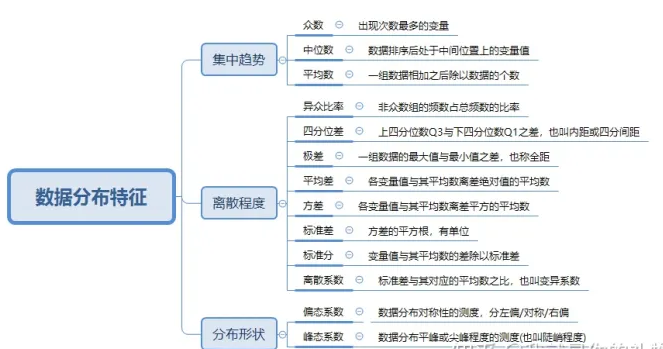
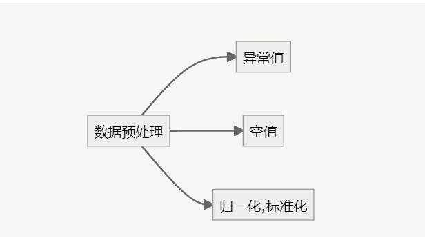
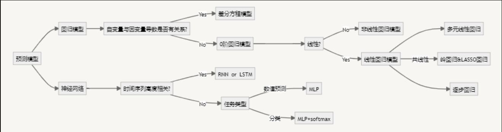
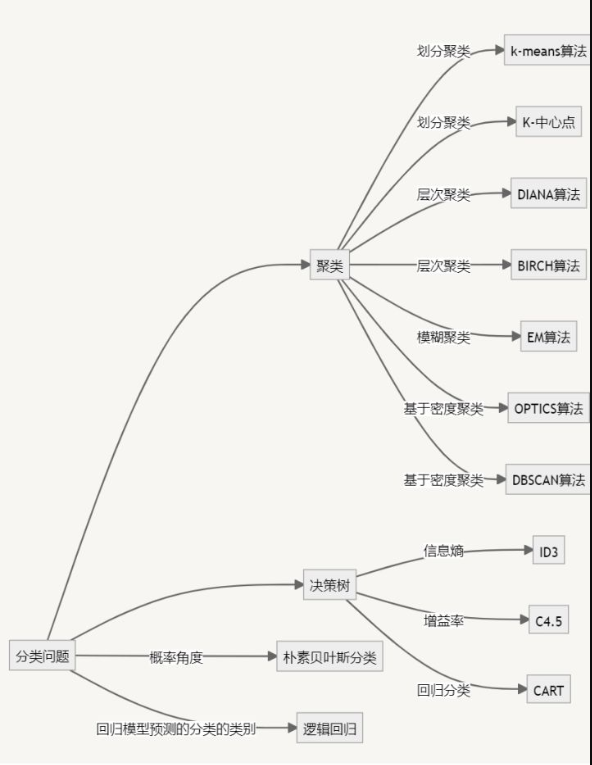
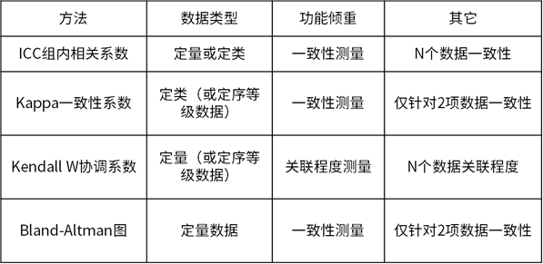

*学习方法 的 ==使用前提（适用条件）==，==作用==？==优缺点==？==怎么用==？*

# 数据处理-pandas-numpy-matplotlib-seaborn

## 0、基本知识

* 1、数据的类型、分布特征
* 2、总体与样本
* 3、参数和统计量
* 4、变量、特征

### 数据的类型、分布特征

~~~tex
分类数据和顺序数据说明的是事物的品质特征，通常用文字来表述的结果表现的都是类别，都可称为定性数据或者品质数据（qualitative data）

数值型数据说明的是现象的数量特征，通常是用数值来表现的，因此称为定量数据或数量数据(quantitative data)。

区分数据类型的意义：区分不同类型的数据采用不同的统计方法来处理和分析。
如：
1、分类数据我们通常计算各组的频数、众数、异众比率，进行列联表分析和卡方检验等；
2、顺序数据可计算中位数和四分位差以及等级相关系数等；
3、数值型数据可计算更多统计量、进行参数估计和假设检验等。
~~~

## 1、数据读取与保存

## 2、数据信息查看

### 1、数据的特征的类型

### 2、数据的大小

## 3、数据的描述性分析

***数据分析**所用的方法可以分为**描述统计方法**和**推断统计方法**。*

~~~tex
描述统计：研究的是数据收集、处理、汇总、图表描述、概括与分析等统计方法。

推断统计：是研究如何利用样本数据来推断总体特征的统计方法。
比如：要了解一个地区的人工特征，不可能对每个人的特征一一测量，这种情况下就需要抽取部分个体样本进行测量，然后与根据所获得的样本数据对所研究的总体特征进行推断，这就是推断统计要解决的问题。

描述统计分析
即对调查总体所有变量的有关数据进行统计性描述，简单来说就是将一系列复杂的数据集用几个有代表性的数据进行描述，进而能够直观的解释数据的变动，主要包括数据的离散程度分析、集中趋势分析、频数分析、分布以及一些基本的统计图形。
~~~

**==参考链接==**

[数据分析-描述性分析 - 知乎 (zhihu.com)](https://zhuanlan.zhihu.com/p/144046529)

[数据基本描述之描述性分析 - 知乎 (zhihu.com)](https://zhuanlan.zhihu.com/p/64967217)

* 1、频数分析
* 2、列联表（交叉）分析
* 3、描述性统计
* 4、分类汇总
* 5、正态性检验
* 注意事项

### 3、描述性统计

* **描述性统计分析常用指标**
* * 一是分布的集中趋势，反应各数据向其中心值聚集的程度；
  * 二是分布的离散程度，反应数据远离中心值的趋势；
  * 三是分布的形状，反映数据分布的偏态和峰态

~~~tex
1.反应集中趋势的指标：众数、中位数和分位数、平均数
1.1 众数(mode)：一组数据中出现次数最多的变量

特点：具有不唯一性，一组数据可能有多个众数，也有可能没有众数

应用：数据量多的较多时才有意义，主要适合分类数据的集中趋势测度值

1.2 中位数(median)：一组数据排序后处于中间位置上的变量值
计算公式：中位数位置=(n+1)/2,式中，n为数据个数；
当n为奇数时，Me=在(n+1)/2位置上的数，
当n为偶数时，Me=[在(n/2）位置上的数+在(n/2）+1位置上的数]/2

特点：不受数据极端值的影响，

应用：数据分布偏斜程度大时适合使用，主要适合顺序数据的集中趋势测度值

1.3 四分位数(quartile)：一组数据排序后处于25%和75%位置上的值，也就是用3个点将全部数据4部分，每部分包含25%的数据。中间的四分位数就是中位数，因此通常所说的四分位数是指处在25%位置上的数值（称为下四分位数Q1）和处在75%位置上的数值（称为上四分位数Q3)

计算公式：
四分位数位置的确定方法有多种，每种方法结果会有点差异，差异不大，如下介绍其中一种。
按照定义，四分位数位置确定方法步骤如下：
a.首先对一组数据排序,
b.Q1=n/4位置，Q2=2n/4=n/2位置, Q3位置=3n/4
c.如果位置是整数，四分位数就是该位置对应的值；
如果位置在0.5的位置，则取该位置两侧值的平均数；
如果位置在0.25或者0.75的位置，则取该位置下侧值加上按比例分摊位置两侧数值的差值；

箱线图（box plot）：是由一组数据的最大值、最小值、中位数、两个四分位数这五个特征值绘制而成的,是一种用作显示一组数据分散情况资料的统计图。它主要用于反映原始数据分布的特征，还可以进行多组数据分布特征的比较。
~~~

### 注意事项

~~~tex
1、一般采用平均值加标准差来描述数据的整体情况。

2、当数据呈现严重偏态时，采用中位数描述数据的整体水平情况，而不是平均值。

3、除了使用描述性分析外，也建议使用箱线图直观展示数据分布情况。
~~~

## 4、数据的清洗

### 1、重复记录与重复特征

### 2、缺失值分析与处理

### 3、异常值查找与处理

## 5、数据的合并与连接

## 6、分组聚合操作

### grouped函数的使用

# 数据的可视化

# 数据建模

* 预测
* * 

* 分类
* * 

## 1、多元统计模型

* 1、回归模型
* 2、分类模型
* 3、聚类模型
* 4、因子分析、对应分析、典型相关分析

### 1、回归模型

### 2、分类模型

### 3、聚类模型

## 2、机器学习模型

[scikit-learn中文社区](https://scikit-learn.org.cn/)

* 1、回归模型
* 2、分类模型
* 3、聚类模型

### 1、回归模型

### 2、分类模型

* 1、逻辑回归（二分类、多分类）
* 2、决策树
* 3、支持向量机
* 4、随机森林
* 5、朴素叶贝斯
* 6、bp神经网络
* 7、多层感知机
* 8、k邻近（KNN）
* 9、XGBoost
* 10、LightGBM

### 3、聚类模型

## 3、医学模型

* 1、卡方检验
* * 1、Pearson卡方检验
  * 2、Yates校正卡方检验
  * 3、Fisher精确检验
  * 4、分层卡方检验
  * 5、配对卡方检验
* 2、生存分析

* 3、一致性检验
* * 

## 时间序列分析预测模型

## 一 单变量时间序列预测

1. 自回归 (Autoregression, **AR**)
2. 移动平均线 (Moving Average, **MA**)
3. 自回归移动平均线 (Autoregressive Moving Average, **ARMA**)
4. 自回归综合移动平均线 (Autoregressive Integrated Moving Average, **ARIMA**)
5. 季节性自回归整合移动平均线 (Seasonal Autoregressive Integrated Moving-Average, **SARIMA**)
6. 具有外生回归量的季节性自回归整合移动平均线 (Seasonal Autoregressive Integrated Moving-Average with Exogenous Regressors, **SARIMAX**)

## 二 多变量时间序列预测

1. 向量自回归 (Vector Autoregression, **VAR**)
2. 向量自回归移动平均 (Vector Autoregression Moving-Average, **VARMA**)
3. 具有外源回归量的向量自回归移动平均值 (Vector Autoregression Moving-Average with Exogenous Regressors, **VARMAX**)

## 三 其他

1. 简单指数平滑 (Simple Exponential Smoothing, **SES**)
2. 霍尔特·温特的指数平滑 (Holt Winter’s Exponential Smoothing, **HWES**)

# 循环神经网络（Recurrent Neural Network, RNN）

## 1 RNN之LSTM（Long-Short Term Memory）

## 2 RNN之GRU（Gate Recurrent Unit）

