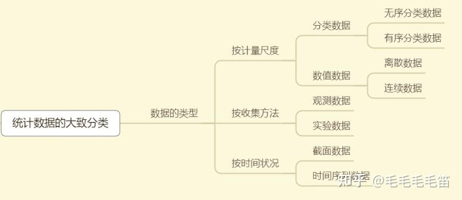
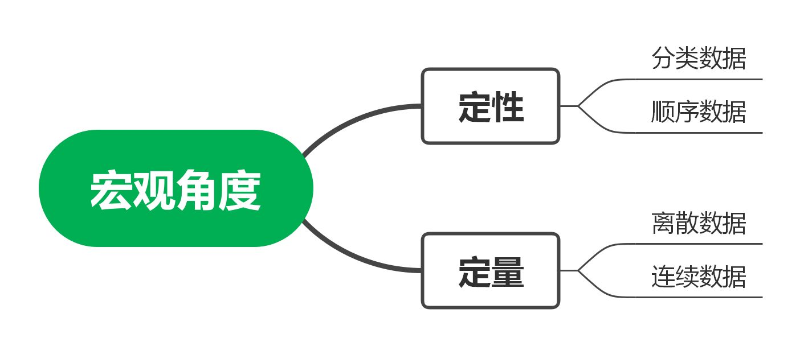
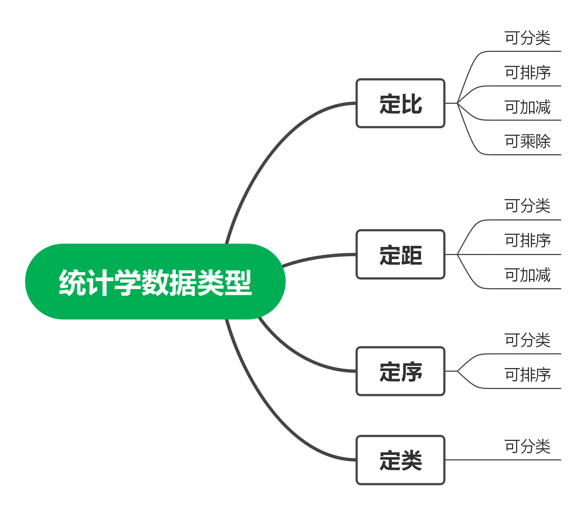
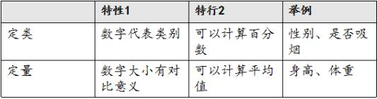
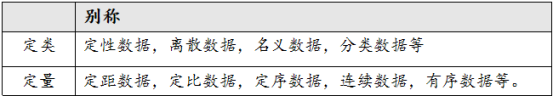
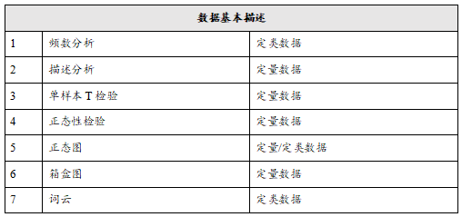
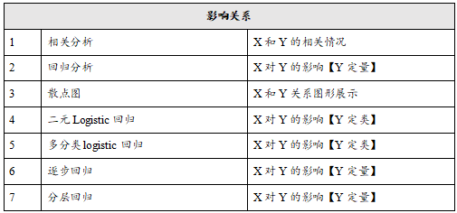
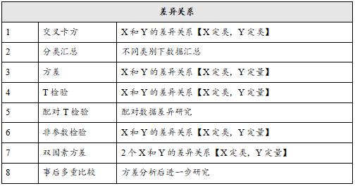
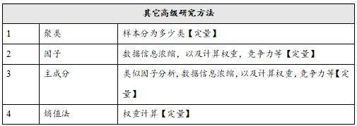
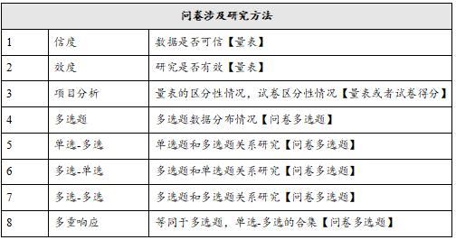

## 0 统计学中的数据类型

### 1.定性数据/定量数据

==**从宏观角度分，数据类型可分为：定性、定量。**==

* 统计学中的数据，大的分类可以分为定性数据和定量数据，二者的主要区别在于是否具有数值特征。

#### 1.1定性数据

* 定性数据又称软数据，是非统计数据，通常是非结构化数据或半结构化，是描述性的和概念性的。根据特性、属性、标签和其他标识符进行分类。
* 表示事物性质、规定事物类别的文字表述型数据，不能将其量化，只能将其定性。
* 定性数据可以用于“为什么”这个问题。定性数据是调查性的，可以进行进一步的研究，从定性数据中生成可以用于解释、发展假设和初步理解。

**定性变量**

- [定类数据](https://www.zhihu.com/search?q=定类数据&search_source=Entity&hybrid_search_source=Entity&hybrid_search_extra={"sourceType"%3A"answer"%2C"sourceId"%3A2802396597})——将事物进行[分类](https://www.zhihu.com/search?q=分类&search_source=Entity&hybrid_search_source=Entity&hybrid_search_extra={"sourceType"%3A"answer"%2C"sourceId"%3A2526503387})或分组的数据，比如性别，男、女。
- [定序数据](https://www.zhihu.com/search?q=定序数据&search_source=Entity&hybrid_search_source=Entity&hybrid_search_extra={"sourceType"%3A"answer"%2C"sourceId"%3A2802396597})——将事物进行顺序排列，比如成绩，优良中及格。

#### 1.2定量数据

* 其特征在于它们都是以数值的形式出现的，有些[数值型数据](https://www.zhihu.com/search?q=数值型数据&search_source=Entity&hybrid_search_source=Entity&hybrid_search_extra={"sourceType"%3A"answer"%2C"sourceId"%3A2025393594})只可以计算数据之间的绝对差，而有些数值型数据不仅可以计算数据之间的绝对差，还可以计算数据之间的相对差。

**[定量变量](https://www.zhihu.com/search?q=定量变量&search_source=Entity&hybrid_search_source=Entity&hybrid_search_extra={"sourceType"%3A"answer"%2C"sourceId"%3A2802396597})**

- [离散数据](https://www.zhihu.com/search?q=离散数据&search_source=Entity&hybrid_search_source=Entity&hybrid_search_extra={"sourceType"%3A"answer"%2C"sourceId"%3A2526503387})——数值只能用自然数或整数单位计算的数据，比如班级学生个数。
- [连续数据](https://www.zhihu.com/search?q=连续数据&search_source=Entity&hybrid_search_source=Entity&hybrid_search_extra={"sourceType"%3A"answer"%2C"sourceId"%3A2526503387})——指在一定区间内可以任意取值、数值是连续不断的、相邻两个数值可取无限个数的数据，比如人测量的身高，其数值只能用测量或计量的方法取得。

### 2.**定序数据/定类数据/定比数据/定距数据**

==**从统计学数据类型划分，可分为：[定比](https://www.zhihu.com/search?q=定比&search_source=Entity&hybrid_search_source=Entity&hybrid_search_extra={"sourceType"%3A"answer"%2C"sourceId"%3A2802396597})、定距、定类、定序。**==

在统计学中，需要进一步细分数据的类型，又对数据类型划分了一定的等级层次，从低到高可分为以下四种类型：

- **定类数据：**[名义级数据](https://www.zhihu.com/search?q=名义级数据&search_source=Entity&hybrid_search_source=Entity&hybrid_search_extra={"sourceType"%3A"answer"%2C"sourceId"%3A2025393594})，数据的最低级，表示个体在属性上的特征或类别上的不同变量，仅仅是一种标志，没有序次关系。例如， ”性别“，”男“编码为1，”女“编码为2。
- **定序数据:** 数据的中间级，用数字表示个体在某个有序状态中所处的位置，不能做四则运算。例如，“受教育程度”，文盲半文盲=1，小学=2，初中=3，高中=4，大学=5，硕士研究生=6，博士及其以上=7。
- **定距数据：**具有间距特征的变量，有单位，没有[绝对零点](https://www.zhihu.com/search?q=绝对零点&search_source=Entity&hybrid_search_source=Entity&hybrid_search_extra={"sourceType"%3A"answer"%2C"sourceId"%3A2025393594})，可以做加减运算，不能做[乘除运算](https://www.zhihu.com/search?q=乘除运算&search_source=Entity&hybrid_search_source=Entity&hybrid_search_extra={"sourceType"%3A"answer"%2C"sourceId"%3A2025393594})。例如，温度。
- **定比数据:** 数据的最高级，既有[测量单位](https://www.zhihu.com/search?q=测量单位&search_source=Entity&hybrid_search_source=Entity&hybrid_search_extra={"sourceType"%3A"answer"%2C"sourceId"%3A2025393594})，也有绝对零点，增加一个确定的[基准值](https://www.zhihu.com/search?q=基准值&search_source=Entity&hybrid_search_source=Entity&hybrid_search_extra={"sourceType"%3A"answer"%2C"sourceId"%3A2025393594})或标准，能够进行比对。例如职工人数，身高。

### 3.**定类数据/定量数据**

==注意==

虽然各个领域对数据类型的称呼各不相同，但实际意义均一致，只需要理解一句话即**“算百分比时叫定类数据，算平均值时叫定量数据”。**

### 4.计量资料和计数资料

## 一.数据挖掘基础

### 1.1 数据挖掘的基本任务

* 分类与预测、聚类分析、关联规则、时序模型、偏差检测、智能推荐等。提取数据价值。

### 1.2 数据挖掘建模过程

#### 1、定义挖掘目标

明确目标定义，分析应用领域，决定要做什么。

####  2、数据取样

在明确需要进行数据挖掘的目标之后，接下来就需要从业务系统抽取出一个与挖掘目标相关的样本数据子集。

* ==抽取数据的标准==
* * 相关性
  * 可靠性
  * 有效性  

关注数据质量，保证数据完整性和有效性。取样数据质量标准：1、资料完整，指标齐全 2、数据准确 3、随机抽样 4、等距抽样 5、分层抽样 6、从起始顺序抽样 7、分类抽样（按属性取样）

#### 3、数据的探索

对抽样得到的数据探索、审核和必要的加工。数据探索与预处理的目的是为了保证样本数据的质量，从而为保证模型质量打下基础。

常用的数据探索方法主要包括两方面：数据质量分析；数据特征分析

**==3.1数据质量分析==**

检查数据中是否存在脏数据：缺失值、异常值、不一致的值、重复数据及含有特殊符合的数据。

* 1、==缺失值分析：==  
  
  检验数据是否录错或含不合理数据，分析其产生的原因。  

  记录的缺失和记录中某个字段信息的缺失（三种处理情况：删除，插补，不处理）  

* 2、==异常值分析：==

  异常值：样本中的个别值，其数值明显偏离其余的观测值。异常值也称为离群点，异常值的分析也称为离群点分析。  

  异常值的方法：箱线图。  

* 3、==数据的一致性分析：==  
  
  数据的不一致性是指数据的矛盾性、不相容性。直接对不一致的数据进行挖掘，可能会产生与实际相违背的挖掘结果  
  
**==3.2数据特征分析==**  

绘制图表，计算某些特征量等。数据特性分析主要包括：分布分析，对比分析，统计量分析，周期性分析，贡献度分析和相关性分析。  

  * （3.2.1）、分布分析：  
  
  能揭示数据的分布特征和分布类型。  

  * （3.2.2）、对比分析：  
  
    比较两个相互联系的指标（横向比较、时间序列比较），选择对比标准为关键。  

  * （3.2.3）、统计量分析：  
  
    用统计指标对定量数据进行统计描述。集中趋势（均值，中位数）和离中趋势（方差，四分位间距）  

  * （3.2.4）、周期性分析：  
  
    探索变量是否随着时间变化是否随时间变化呈现某种周期变化趋势。（时间有长有短）  

  * （3.2.5）、贡献度分析（帕累托分析）：  
  
    同样的投入放在不同的地方会产生不同的收益。  
    
  * （3.2.6）、相关性分析：  
  
    分析连续变量之间线性相关程度的强弱，用适当的统计指标表示出来。直观方法：绘制散点图。可计算相关系数分析，在二元变量相关分析常用Pearson相关系数，Spearman秩相关系数，判定系数。

**==3.3数据的特征分析==**

对数据进行质量分析以后，可通过绘制图表、计算某些特征量等手段进行数据的特征分析。数据特征分析主要包括：分布分析、对比分析、统计量分析、周期性分析、贡献度分析、相关性分析。

#### 4、数据的预处理

常用的数据预处理主要包括：数据清洗、数据集成、数据变换、数据规约等。

* ==4.1 数据清洗==：  
  
  * 4.1.1、缺失值处理：  
      
  删除存在缺失值的记录、对可能值进行插补和不处理三种情况。在很多情况下，原始数据集中缺失值需要使用算法进行插补，典型算法：拉格朗日插值、牛顿插值法。  

  * 4.1.2、异常值处理：  
  
  删除有异常值的记录（存在较大缺点），将异常值视为缺失值处理，分析异常值出现的原因，判断取舍。  

* ==4.2 数据集成==：  
    
  将多个数据源合并存放在一个一致的数据储存的过程。需要考虑实体识别问题和属性沉余问题。  

* ==4.3 数据变换==：  
    
  对数据进行规范化处理，使其适用于挖掘任务和算法需要。常用方法：简单函数变换（平方，开方，取对数，等分运算等），规范化（归一化），连续属性离散化（等宽法，等频法，一维聚类法），属性构造（构造新属性，加入已有属性），小波变换（信号分析手段）。  

* ==4.4 数据规约==：  
  
  更小的保持原数据完整性的新数据集，可提高数据分析、挖掘的效率。主要包括：属性规约（创造新维数或减少维数，找到最小属性子集）、数值规约（有参数方法和无参数方法）。

#### 5、挖掘模型：

对问题进行分类（分类，聚类，关联规则，时序模式，智能推荐），选择算法。

#### 6、模型评价：

从模型中自动找出最好的模型，且根据业务对模型进行解释和应用。不同模型评价方法不同。